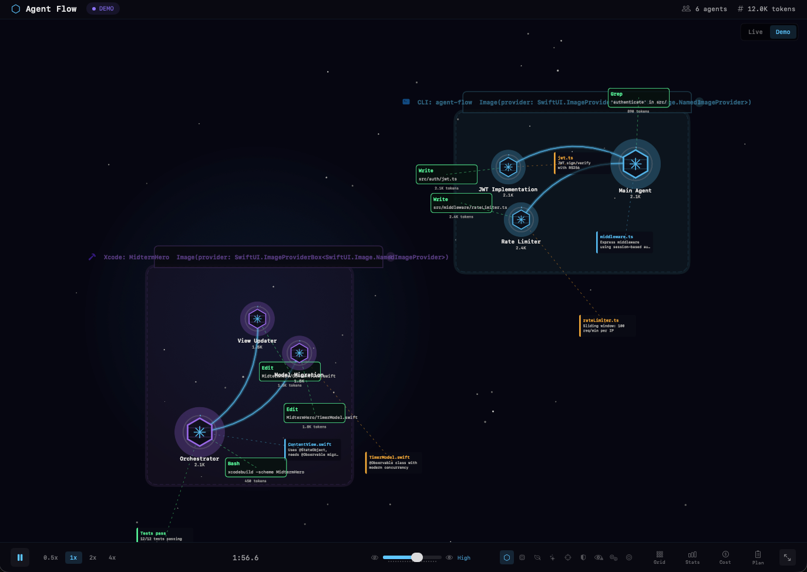
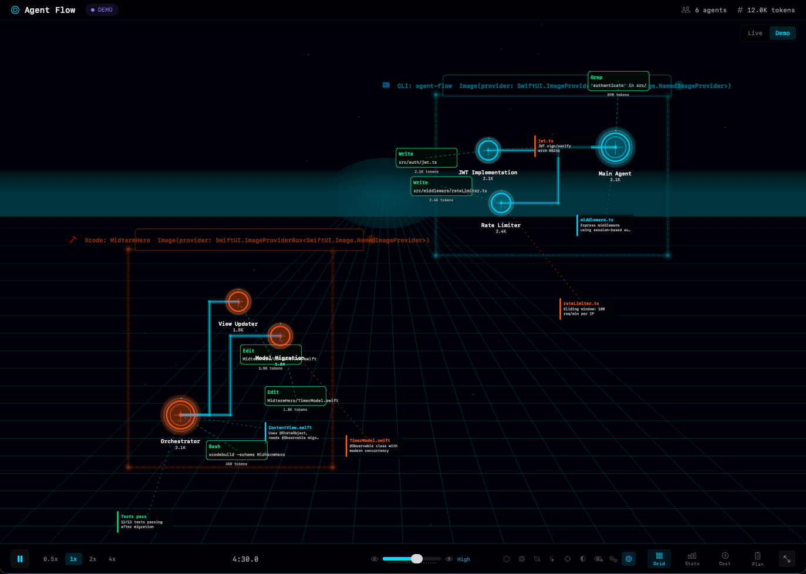
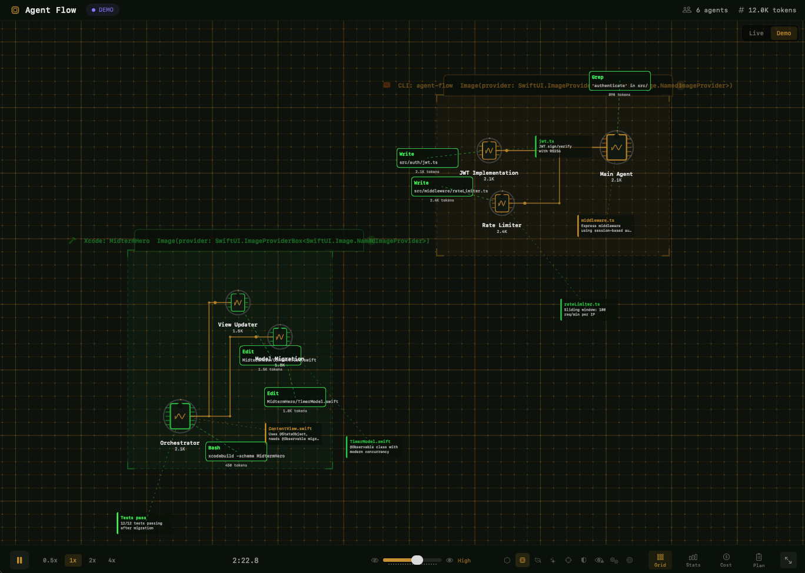
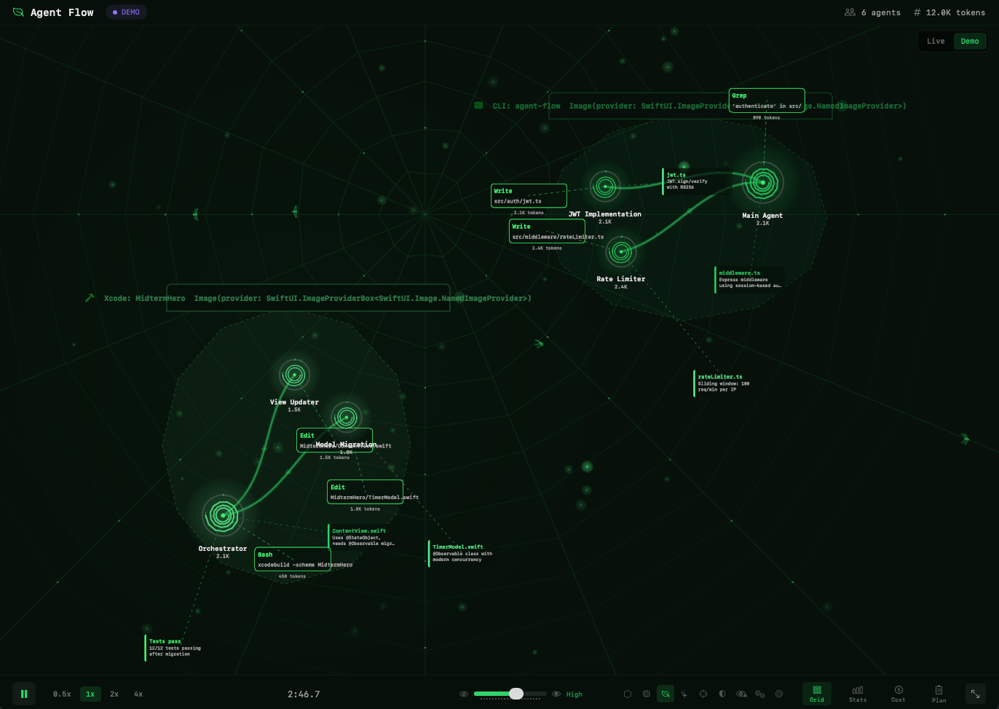
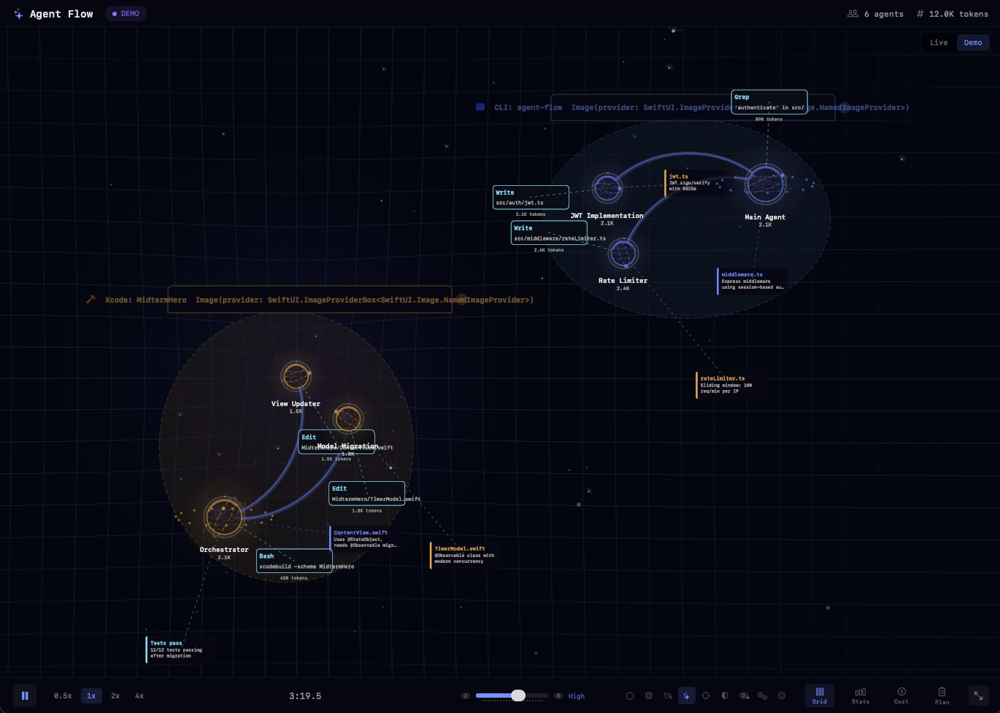
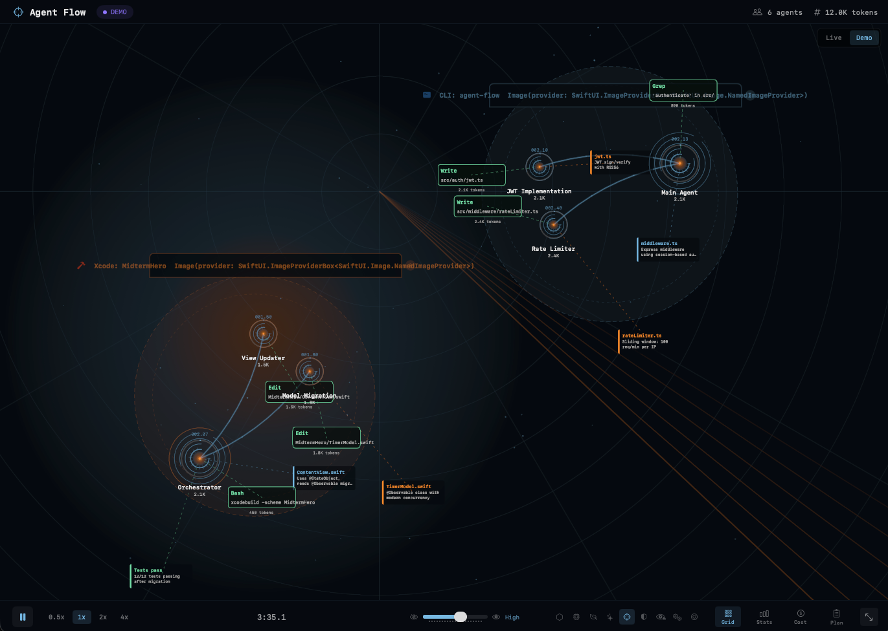
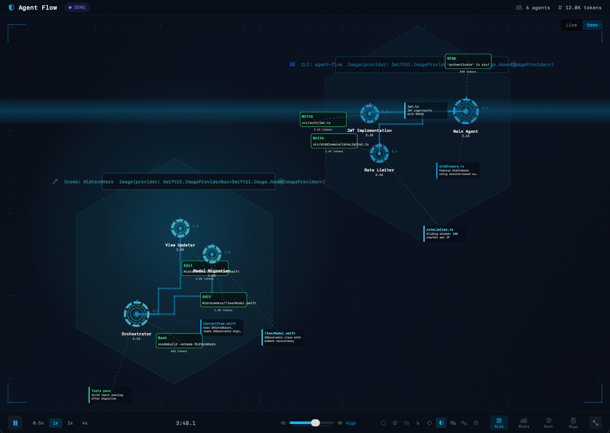
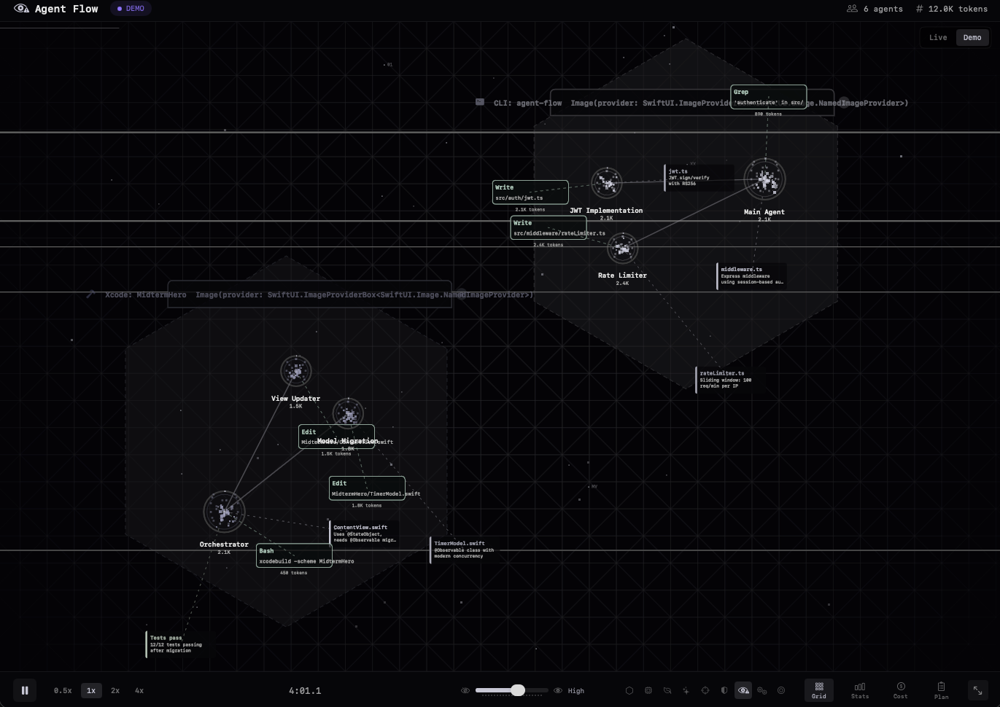
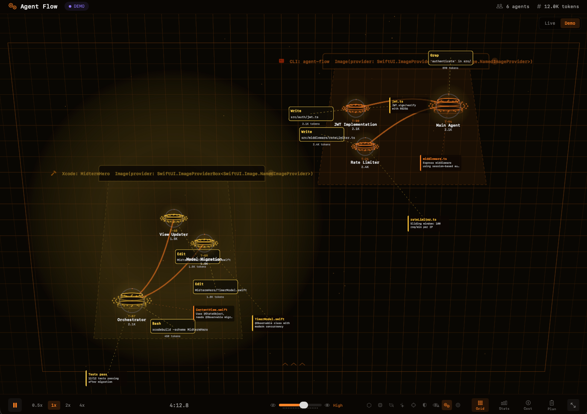

# Agent Flow

Native macOS app for real-time visualization of Claude Code agent sessions. Watch agents think, branch, call tools, and coordinate — rendered as an interactive node graph with multiple visual themes.

> **Forked from [patoles/agent-flow](https://github.com/patoles/agent-flow)** — the original web-based visualizer built by [Simon Patole](https://github.com/patoles) for [CraftMyGame](https://craftmygame.com). This fork replaces the web app and VS Code extension with a standalone native macOS application built in Swift/SwiftUI, adds support for Apple's Xcode coding assistant alongside Claude Code CLI, and introduces multiple visual themes.



## What Changed from Upstream

The upstream project is a **Next.js web app + VS Code extension** that visualizes Claude Code sessions in a browser. This fork is a complete rewrite as a **native macOS app**:

- **Replaced** the web app (`web/`), VS Code extension (`extension/`), and Node.js relay server (`scripts/`) with a single Swift Package (`AgentFlowApp/`)
- **Native rendering** — SwiftUI Canvas with custom 2D renderers for each theme (no browser, no Electron, no WebView)
- **Direct transcript reading** — the app watches `~/.claude/projects/` directly for JSONL transcript files, no hook server or relay needed
- **Xcode support** — also watches `~/Library/Developer/Xcode/CodingAssistant/` for sessions from Apple Intelligence's Claude coding assistant in Xcode 26+
- **Multiple visual themes** — 9 distinct rendering styles (the original had one)
- **Xcode adapter** — bridge scripts for translating Xcode assistant conversation logs into Agent Flow events

## Features

- **Live session detection** — automatically discovers active Claude Code CLI sessions and Xcode coding assistant sessions
- **Multi-session support** — track multiple concurrent sessions from different sources, displayed as color-coded clusters
- **Interactive canvas** — pan, zoom, click agents and tool calls to inspect details
- **9 visual themes** — each with custom background, node rendering, edge drawing, and particle effects
- **Message feed** — always-visible scrollable stream of agent-user communications across all agents
- **Agent detail panel** — click any agent to see its state, token usage, context breakdown, tool history, and full message transcript
- **Plan & task tracking** — view active plans and task lists as agents create them
- **Playback control** — pause, resume, and adjust speed (0.5x to 4x) for live or demo sessions
- **Detail levels** — adjust rendering complexity from minimal to full
- **Cost tracking** — estimated API cost based on token usage
- **Demo mode** — built-in multi-agent scenario to preview the visualization without a live session

## Themes

Agent Flow ships with 9 visual themes. Switch themes from the control bar at the bottom of the window.

### Holograph
The original sci-fi console aesthetic — cyan nodes on deep navy with holographic glow effects.


### Tron
Digital frontier inspired by TRON — electric blue identity discs, light cycle trails, and a neon perspective grid.



### Circuit
PCB traces and chip packages — copper routing on a dark green substrate with solder-point nodes.



### Organism
Bioluminescent forest — emerald nodes with branching fronds, fern spirals, spider web grid, and glowing spores.



### Astral
Celestial orrery — periwinkle planets with orbital rings, nebula wisps, and constellation-line edges.



### Tactical
Military holographic display — ice-blue targeting arcs with concentric rings and amber status indicators.



### Jarvis
Iron Man HUD — segmented ring gauges, angular circuit connectors, and scanning lines in electric cyan.



### Animus
Memory deconstruction — monochrome wireframe mesh with pixel fragments and glitch effects.



### Forge
Industrial mechanical hologram — amber-orange cylinders with pipe connectors and perspective wireframe.



## How It Works

Agent Flow watches two directories for Claude session transcripts:

| Source | Directory | Auto-detected |
|--------|-----------|---------------|
| **Claude Code CLI** | `~/.claude/projects/` | Yes |
| **Xcode Coding Assistant** | `~/Library/Developer/Xcode/CodingAssistant/ClaudeAgentConfig/projects/` | Yes |

When a session is active, the app tails the JSONL transcript files and translates each entry into visualization events: agent spawns, tool calls, messages, subagent dispatch/return, context updates, and completions.

### Xcode Adapter (Optional)

For additional control over Xcode assistant visualization, the `xcode-adapter/` directory provides:

- **`bridge.js`** — tails Xcode conversation logs and writes Agent Flow events to a JSONL file
- **`event-log-tail.js`** — forwards those events to a hook server for merging into the visualization

```bash
node xcode-adapter/bridge.js          # tail Xcode logs
node xcode-adapter/event-log-tail.js  # forward to hook server
```

See [`xcode-adapter/README.md`](xcode-adapter/README.md) for configuration details.

## Panels & Views

### Message Feed (top-left)
Always-visible stream of communications between you and the agents. Shows the latest message in collapsed mode; click to expand into a scrollable feed with per-agent tabs. Press **M** to toggle.

### Agent Detail Panel (left side)
Click any agent node to inspect:
- Current state and token usage with context breakdown (system, user, tools, reasoning, subagent)
- Recent tool calls with status and token cost
- Full message history (user prompts, assistant responses, thinking blocks)

### Plan & Task Panel (right side)
When agents create plans or tasks, view them here. Press **P** to toggle. Shows the active plan content and a task list with status tracking (pending, in progress, completed, blocked).

### Stats Overlay
Press **S** to show agent count, tool call count, edge count, particle count, total tokens, zoom level, and detail level.

## Keyboard Shortcuts

| Key | Action |
|-----|--------|
| **Space** | Play / Pause |
| **F** | Zoom to fit all agents |
| **G** | Toggle grid |
| **S** | Toggle stats overlay |
| **M** | Toggle message feed |
| **P** | Toggle plan & task panel |
| **1 / 2 / 3 / 4** | Playback speed (0.5x / 1x / 2x / 4x) |
| **D / Shift+D** | Decrease / increase detail level |
| **Escape** | Deselect agent or tool call |

## Install

### Download (recommended)

1. Download `AgentFlow-v1.0.0-mac.zip` from [Releases](https://github.com/jamesashley1/agent-flow/releases)
2. Unzip and drag **Agent Flow.app** to `/Applications`
3. Double-click to launch — the app is signed and notarized, no Gatekeeper warnings

### Build from Source

Requires macOS 14+ and Swift 5.9+.

```bash
git clone https://github.com/jamesashley1/agent-flow.git
cd agent-flow/AgentFlowApp
swift build -c release
```

The binary is at `.build/release/AgentFlow`. To create a distributable `.app` bundle:

```bash
cd agent-flow
./scripts/package-app.sh
# Output: dist/Agent Flow.app and dist/AgentFlow-v1.0.0-mac.zip
```

To sign with your Developer ID:

```bash
./scripts/package-app.sh --sign "Developer ID Application: Your Name (TEAMID)"
```

To sign and notarize:

```bash
./scripts/package-app.sh --sign "Developer ID Application: Your Name (TEAMID)" --notarize
```

## Usage

1. Launch **Agent Flow**
2. Start a Claude Code session in any terminal, or use the Claude coding assistant in Xcode 26+
3. Agent Flow auto-detects the session and streams events in real time
4. Click agents to inspect details, use the control bar to switch themes, adjust speed, or toggle panels

To preview without a live session, click **Demo** in the top-right corner.

## Requirements

- macOS 14+ (Sonoma)
- Claude Code CLI and/or Xcode 26+ with Claude coding assistant

## Project Structure

```
agent-flow/
├── AgentFlowApp/
│   ├── Package.swift
│   └── Sources/
│       ├── AgentFlowApp.swift              # App entry point
│       ├── Models/                         # Agent, state, themes, plan/task models
│       ├── Views/                          # SwiftUI views, panels, gesture handling
│       ├── Rendering/                      # 9 theme renderers + shared renderers
│       └── Simulation/                     # Engine, transcript parser, session watcher
├── xcode-adapter/                          # Xcode assistant bridge scripts
├── scripts/
│   └── package-app.sh                      # Build, sign, notarize .app bundle
├── LICENSE                                 # Apache 2.0
└── README.md
```

## Credits

Based on [agent-flow](https://github.com/patoles/agent-flow) by [Simon Patole](https://github.com/patoles), originally built for [CraftMyGame](https://craftmygame.com).

## License

Apache 2.0 — see [LICENSE](LICENSE) for details.
